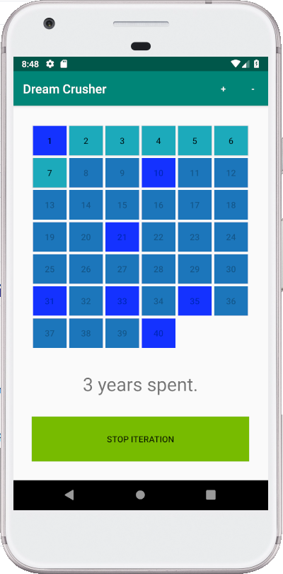

# Dream Crusher

## How many years can you spend trying to win lotto until you quit?

### Introduction

This project was made for a school course on mobile programming.

It's a simple lotto application, where user chooses 7 numbers and the app starts generating random numbers and checks how many of them match.

The app is made so that user may exit the app using the "home" button on the device, and the app will still iterate in the background.

The app was made using Android Studio.

